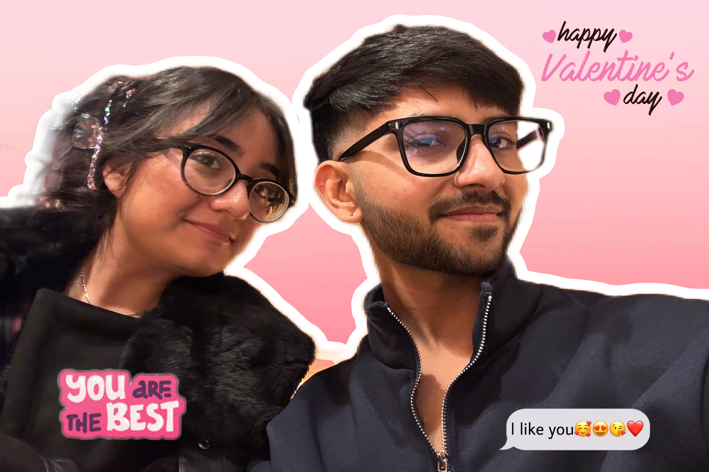

<!DOCTYPE html>
<html lang="en">
<head>
    <meta charset="UTF-8">
    <meta name="viewport" content="width=device-width, initial-scale=1.0">
    <title>Will You Be My Valentine? 💖</title>
    
</head>
<body>
    <!-- Valentine's Question Card -->
    

        
❤️

        <h1>Will you be my Valentine? 💖</h1>
        
🐻

        

            <button onclick="sayYes()">Yes! 😍</button>
            <button onclick="sayNo()">No 🙈</button>
        

        

    

    <!-- Fullscreen Image Popup -->
    

        

            
            <h2>Thank you for choosing me! 💖 You made my day!</h2>
        

    

    
</body>
</html>
